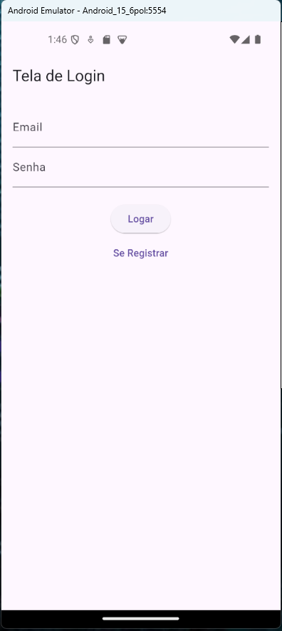
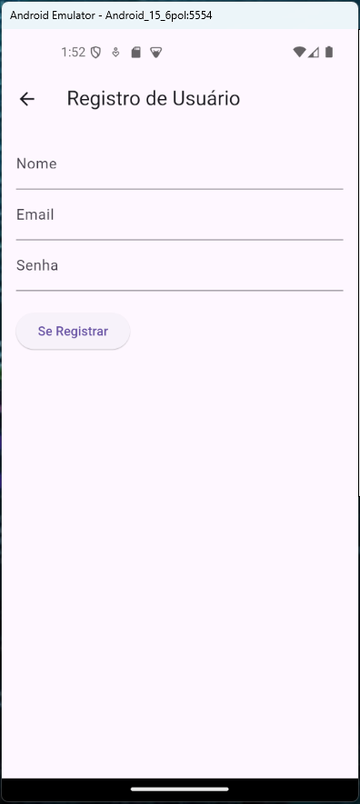
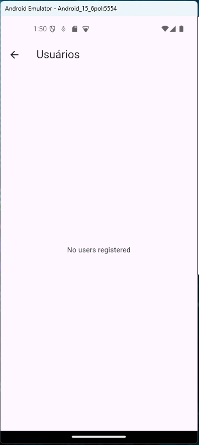

# Trabalho da matéria Mobile Development

<<<<<<< HEAD
Projeto em Flutter.

## Sobre o projeto

## Demostração do projeto

## Capturas de Tela

### Tela Login

### Tela Registro Usuário

### Tela Usuário

## Começando

Este projeto é um ponto de partida para uma aplicação Flutter.

Alguns recursos para você começar se este for seu primeiro projeto Flutter:

Laboratório: Escreva seu primeiro aplicativo Flutter
Livro de receitas: exemplos úteis do Flutter
Para obter ajuda para começar a desenvolver o Flutter, consulte o documentação online, que oferece tutoriais, exemplos, orientações sobre desenvolvimento móvel e uma referência completa da API.
=======
Projeto em  Flutter.

## Sobre o projeto

### Começando

Este projeto é um ponto de partida para uma aplicação Flutter.

Alguns recursos para você começar se este for seu primeiro projeto Flutter:

- [Laboratório: Escreva seu primeiro aplicativo Flutter](https://docs.flutter.dev/get-started/codelab)
- [Livro de receitas: exemplos úteis do Flutter](https://docs.flutter.dev/cookbook)

Para obter ajuda para começar a desenvolver o Flutter, consulte o
[documentação online](https://docs.flutter.dev/), que oferece tutoriais,
exemplos, orientações sobre desenvolvimento móvel e uma referência completa da API.
>>>>>>> f51d3a314d27ea5115a5eb07aa9abcf6917f2a65
